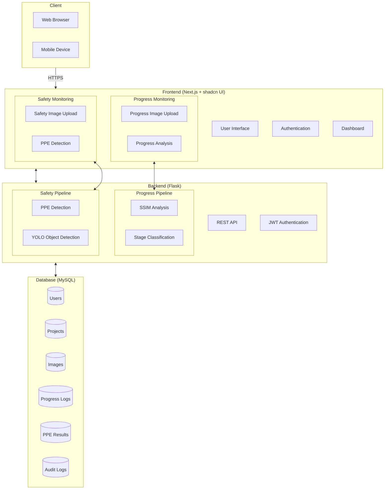
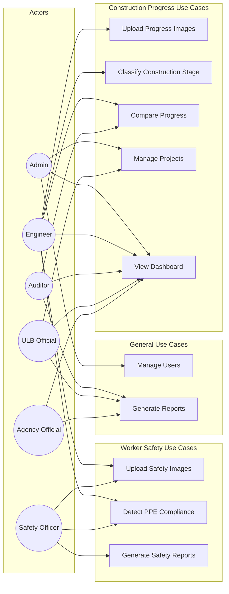
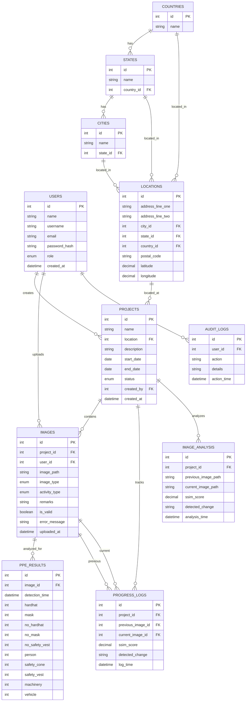
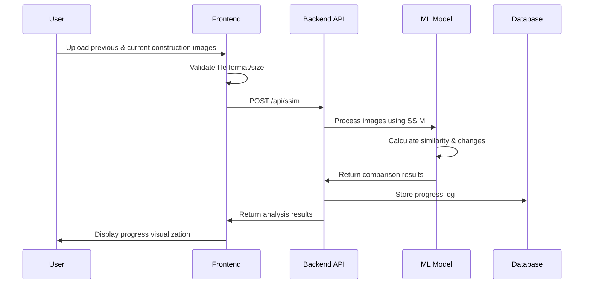
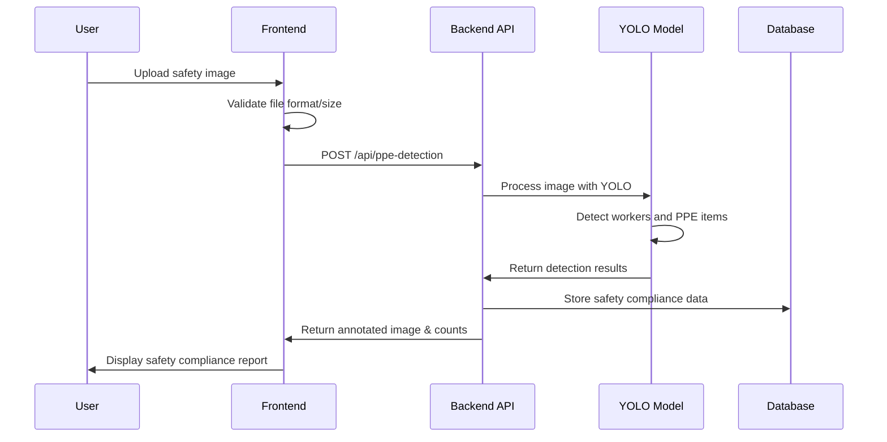

# Software Requirements Document

## IBCM: Image Based Construction Monitoring

**Version:** 1.1  
**Date:** June 2024  
**Prepared by:** IBCM Development Team

---

## 1. Introduction

### 1.1 Purpose
This document specifies the requirements for the Image Based Construction Monitoring (IBCM) system. IBCM is a machine learning-based software solution designed to identify the stage of construction activities through image processing, and track progress without requiring constant physical site visits from technical experts.

### 1.2 Scope
The IBCM system will enable users to upload construction site images, automatically classify construction stages, compare progress over time, detect safety compliance, and generate reports. This system will serve urban local bodies (ULBs), state agencies, and central agencies responsible for monitoring construction projects.

### 1.3 Definitions and Acronyms
- **IBCM:** Image Based Construction Monitoring
- **ML:** Machine Learning
- **ULB:** Urban Local Body
- **PPE:** Personal Protective Equipment
- **SSIM:** Structural Similarity Index Measure
- **API:** Application Programming Interface
- **YOLO:** You Only Look Once (object detection algorithm)

---

## 2. System Overview

### 2.1 System Description
IBCM is a web-based application that utilizes machine learning algorithms to process and analyze construction site images. The system has two primary functions:

1. **Construction Progress Monitoring:** Identifies the stage of construction, compares current images with previous ones to track progress over time, and generates analytics about construction advancement.

2. **Worker Safety Compliance:** Analyzes images for proper use of Personal Protective Equipment (PPE), detects safety violations, and provides safety compliance reports.

Both systems work independently but are integrated into a unified dashboard for comprehensive project oversight.

### 2.2 System Architecture
The system employs a three-tier architecture:
1. **Frontend:** Next.js with shadcn UI components
2. **Backend:** Flask RESTful API server
3. **Database:** MySQL RDBMS

### 2.3 User Classes and Characteristics
1. **Admin Users:** System administrators with full access
2. **Engineers:** Technical staff who upload images and analyze progress
3. **Auditors:** Users responsible for verifying reported progress
4. **ULB Officials:** Urban local body representatives monitoring municipal projects
5. **Agency Officials:** State or central agency representatives overseeing multiple projects
6. **Safety Officers:** Staff responsible for monitoring worker safety compliance

---

## 2.4 System Diagrams

### 2.4.1 System Architecture Diagram

### 2.4.2 Use Case Diagram

### 2.4.3 Entity Relationship Diagram

### 2.4.4 Construction Progress Sequence Diagram

### 2.4.5 Worker Safety Sequence Diagram

---

## 3. Functional Requirements

### 3.1 Construction Progress Monitoring
#### 3.1.1 Progress Image Upload
- The system shall allow users to upload **pairs** of construction site images (previous and current) in common formats (JPEG, PNG)
- The system shall require users to select the project and construction activity type during upload
- The system shall validate that both images belong to the same construction site and perspective

#### 3.1.2 Progress Image Classification
- The system shall automatically classify uploaded images into construction stages (foundation, super-structure, facade, interiors, finishing)
- The system shall validate if the uploaded image matches the selected construction activity type
- The system shall generate error messages if there's a mismatch between selected category and detected content

#### 3.1.3 Progress Analysis
- The system shall compare the current image with previous images from the same project
- The system shall calculate similarity scores using SSIM and other appropriate methods
- The system shall identify and highlight changes between images
- The system shall quantify construction progress as a percentage
- The system shall identify the stage of construction based on image analysis
- The system shall track progress over time using a timeline of uploaded images

### 3.2 Worker Safety Monitoring
#### 3.2.1 Safety Image Upload
- The system shall allow users to upload **single** images of workers at construction sites
- The system shall not require previous/current image pairs for safety analysis
- The system shall validate that the image contains identifiable workers and is suitable for PPE detection

#### 3.2.2 PPE Detection
- The system shall detect personal protective equipment (PPE) in uploaded images
- The system shall identify safety violations (missing hardhats, masks, safety vests)
- The system shall count and categorize individuals and safety equipment
- The system shall generate annotated images highlighting detected workers and PPE items

#### 3.2.3 Safety Reporting
- The system shall generate safety compliance reports for each project
- The system shall track safety compliance over time
- The system shall alert users to critical safety violations
- The system shall provide statistics on PPE usage and violations

### 3.3 User Management
- The system shall support user registration and authentication
- The system shall implement role-based access control
- The system shall maintain audit logs of all user actions

### 3.4 Project Management
- The system shall allow creation and management of construction projects
- The system shall support geographical tagging of projects
- The system shall track project timelines and status

### 3.5 Reporting and Analytics
- The system shall generate detailed reports on construction progress
- The system shall provide visual analytics through charts and graphs
- The system shall support data export in common formats (CSV, PDF)

---

## 4. Non-Functional Requirements

### 4.1 Performance
- The system shall process image uploads and provide classification results within 30 seconds
- The system shall support concurrent usage by at least 100 users
- The database shall handle at least 10,000 images while maintaining acceptable response times

### 4.2 Security
- All communications shall be encrypted using TLS
- User passwords shall be stored using secure hashing algorithms
- The system shall implement protection against common web vulnerabilities

### 4.3 Reliability
- The system shall have an uptime of at least 99.5%
- The system shall back up data at least once per day
- The system shall handle errors gracefully and provide meaningful error messages

### 4.4 Usability
- The user interface shall be responsive and work on desktop and mobile devices
- The system shall provide clear feedback for user actions
- The system shall include help documentation and tooltips

### 4.5 Scalability
- The system architecture shall support horizontal scaling
- The database schema shall be optimized for growth
- The system shall use efficient algorithms suitable for large-scale image processing

---

## 5. External Interface Requirements

### 5.1 User Interfaces
- **Dashboard:** Main interface for visualizing project progress and safety compliance
- **Progress Image Upload:** Interface specifically for uploading and comparing construction progress images
- **Safety Image Upload:** Separate interface for uploading worker safety images
- **Progress Tracking:** Interface for comparing images and analyzing progress
- **Safety Monitoring:** Interface for PPE detection and safety compliance
- **Project Management:** Interface for managing projects and locations
- **User Management:** Interface for managing user accounts and roles
- **Reporting:** Interface for generating and viewing reports

### 5.2 API Interfaces
- **Authentication API:** Endpoints for user registration, login, and token management
- **Progress API:** 
  - `/api/ssim` (POST): For uploading previous/current image pairs and analyzing construction progress
- **Safety API:** 
  - `/api/ppe-detection` (POST): For uploading worker images and detecting PPE compliance
- **Project Management API:** Endpoints for project creation and management
- **Reporting API:** Endpoints for generating and accessing reports

### 5.3 Machine Learning Models
- **Construction Stage Classification Model:** For identifying construction stages
- **SSIM Analysis Model:** For comparing image similarity and detecting changes
- **PPE Detection Model:** YOLO-based model for identifying people and safety equipment

---

## 6. System Features and Use Cases

### 6.1 Construction Progress Monitoring
#### Use Case: Analyze Construction Progress
- **Actors:** Engineer, Auditor
- **Description:** User compares current image with previous images to track progress
- **Flow:**
  1. User selects a project
  2. User uploads both previous and current images
  3. User selects the construction activity type
  4. System processes the image pair using SSIM analysis
  5. System calculates similarity scores and progress percentage
  6. System displays the comparison results and progress analytics
  7. System stores the progress logs in the database

### 6.2 Worker Safety Monitoring
#### Use Case: Monitor PPE Compliance
- **Actors:** Engineer, Safety Officer
- **Description:** User uploads an image to check for safety compliance
- **Flow:**
  1. User selects a project
  2. User uploads a single image of workers at the construction site
  3. System processes the image with the YOLO-based PPE detection model
  4. System identifies individuals and PPE items
  5. System generates an annotated image highlighting detections
  6. System reports on compliance status and any violations
  7. System stores the safety results in the database

### 6.3 Project Management
#### Use Case: Create New Construction Project
- **Actors:** Admin, ULB Official
- **Description:** User creates a new construction project in the system
- **Flow:**
  1. User enters project details (name, description, location)
  2. User sets project timeline (start date, end date)
  3. User assigns project team members
  4. System creates the project record
  5. System notifies relevant stakeholders

### 6.4 Reporting and Dashboard
#### Use Case: Generate Comprehensive Project Report
- **Actors:** All Users
- **Description:** User generates a report on project progress and safety
- **Flow:**
  1. User selects a project
  2. User defines the report parameters (date range, metrics, report type)
  3. System compiles data from image analysis, progress tracking, and safety records
  4. System generates visual representations (charts, graphs)
  5. System provides export options for the report

---

## 7. Database Requirements

### 7.1 Entity Relationship
The database schema includes the following key entities and their relationships:

1. **Users**
   - Contains user account information including authentication credentials and role
   - Roles are stored as an ENUM ('admin', 'engineer', 'auditor', 'ulb_official', 'agency_official')
   - Each user may create multiple projects and upload multiple images
   - Key fields: id (PK), name, username, email, password_hash, role, created_at

2. **Location Hierarchy**
   - **Countries**: Basic country information (id, name)
   - **States**: States/provinces within countries, linked to country_id as FK
   - **Cities**: Cities within states, linked to state_id as FK
   - **Locations**: Detailed location information including address lines, postal code, and coordinates
     - Contains foreign keys to cities, states, and countries

3. **Projects**
   - Core project information including name, description, timeline, and status
   - Linked to a specific location (FK) and the user who created it (created_by FK)
   - Status tracked as an ENUM ('planned', 'in_progress', 'completed', 'on_hold')
   - Includes dates (start_date, end_date) and creation timestamp (created_at)

4. **Images**
   - Metadata about uploaded images including image_path, image_type, and validation status
   - Distinguished by image_type ENUM ('progress', 'safety')
   - Categorized by activity_type ENUM ('foundation', 'super_structure', 'facade', 'interiors', 'finishing')
   - Associated with specific projects (project_id FK) and users (user_id FK)
   - Includes validation fields (is_valid, error_message) and timestamp (uploaded_at)

5. **Image Analysis**
   - Records of image comparisons performed for construction progress monitoring
   - Stores paths to compared images (previous_image_path, current_image_path)
   - Contains similarity scores (ssim_score) and detected changes
   - Linked to specific projects (project_id FK)
   - Includes timestamp of analysis (analysis_time)

6. **Progress Logs**
   - Similar to Image Analysis but references specific image records via FKs
   - Links previous_image_id and current_image_id for tracking construction progress over time
   - Stores SSIM scores and detected changes
   - Linked to projects (project_id FK)
   - Includes timestamp of log creation (log_time)

7. **PPE Results**
   - Records of PPE detection analysis performed on images
   - Linked directly to an image record (image_id FK)
   - Contains count fields for various PPE types:
     - hardhat, mask, safety_vest
     - no_hardhat, no_mask, no_safety_vest
     - person, safety_cone, machinery, vehicle
   - Includes timestamp of detection (detection_time)

8. **Audit Logs**
   - Security audit trail of user actions within the system
   - Records user ID (user_id FK), action performed, details, and timestamp (action_time)
   - Helps with security monitoring and troubleshooting

### 7.2 Data Requirements
- User passwords are stored as secure hashes using TEXT datatype
- Location coordinates use DECIMAL data type with appropriate precision:
  - latitude DECIMAL(10,8)
  - longitude DECIMAL(11,8)
- Similarity scores use DECIMAL(5,4) to store values between 0 and 1 with four decimal places
- Image paths are stored as TEXT to accommodate varying path lengths
- All tables include primary keys, using AUTO_INCREMENT for ID fields
- Foreign key constraints are implemented to maintain referential integrity
- TIMESTAMP data type is used for audit records and time-sensitive data
- Appropriate indexing is implemented on foreign keys and frequently queried fields:
  - Unique indexes on username and email in the users table
  - Indexes on all foreign key columns for efficient joins
- ENUM types are used for fields with predefined value sets to ensure data consistency, including:
  - User roles
  - Project status
  - Image types
  - Activity types

---

## 8. Technical Implementation

### 8.1 Frontend Implementation
- **Framework:** Next.js
- **UI Components:** shadcn UI
- **State Management:** React Context API
- **Charts and Visualizations:** shadcn UI components for charts
- **Routing:** Next.js routing for navigation
- **Form Handling:** React Hook Form

### 8.2 Backend Implementation
- **Framework:** Flask
- **API Design:** RESTful API with JSON responses
- **Authentication:** JWT-based authentication
- **Progress Image Processing:** OpenCV, NumPy, scikit-image (for SSIM)
- **Safety Image Processing:** PyTorch, YOLO for object detection

### 8.3 Database Implementation
- **RDBMS:** MySQL
- **Schema Design:** Normalized structure following 4NF
- **Security:** Prepared statements to prevent SQL injection
- **Performance:** Appropriate indexing for common queries

---

## 9. System Constraints

### 9.1 Hardware Limitations
- The system requires sufficient GPU resources for model training and inference
- The image processing pipeline requires adequate memory for handling large images

### 9.2 Software Limitations
- The ML models will require periodic retraining to maintain accuracy
- The system may have limitations on the size and format of uploaded images

### 9.3 Integration Constraints
- The system must integrate with existing project management tools
- The system should provide APIs for potential future integrations

---

## 10. Testing Requirements

### 10.1 Unit Testing
- Each API endpoint shall have unit tests
- ML models shall be tested for accuracy and performance

### 10.2 Integration Testing
- Frontend and backend integration shall be tested
- Database operations shall be validated

### 10.3 User Acceptance Testing
- The system shall be tested with actual construction images
- Representative users from each user class shall participate in UAT

---

## 11. Deployment Requirements

### 11.1 Installation
- The system shall be deployable via Docker containers
- Database migration scripts shall be provided

### 11.2 Configuration
- The system shall support environment-specific configuration
- API keys and sensitive information shall be managed through environment variables

### 11.3 Maintenance
- The system shall include monitoring capabilities
- Regular backups shall be scheduled
- ML models shall be re-trainable as new data becomes available

---

## 12. Appendices

### 12.1 Glossary
- **Foundation:** The structural base of a building
- **Super-structure:** Main load-bearing framework above foundation
- **Facade:** Exterior facing or cladding of a building
- **Interiors:** Internal walls, ceilings, flooring, and fixtures
- **Finishing:** Final decorative elements
- **PPE:** Personal Protective Equipment including hardhats, safety vests, masks, etc.
- **SSIM:** Structural Similarity Index Measure, an algorithm for measuring image similarity

### 12.2 References
- Ministry of Housing and Urban Affairs requirements
- Smart Cities Mission guidelines
- Construction safety regulations
